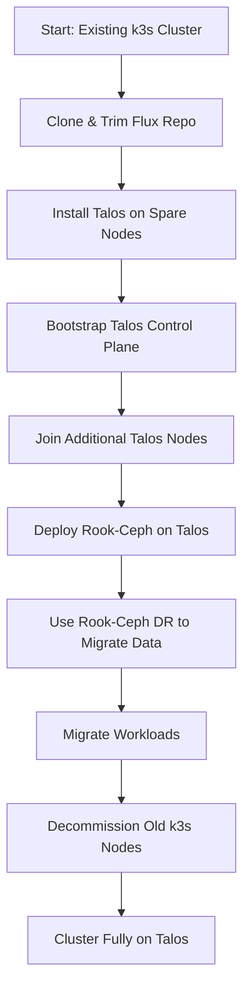

# Debian/k3s to Talos Migration Playbook

[[cluster-restructuring]]

## Introduction

This playbook provides a step-by-step guide for migrating a Kubernetes cluster from Debian/k3s to Talos, including Rook-Ceph data migration using Disaster Recovery (DR) techniques. It is designed for clusters managed via Flux (GitOps), and assumes downtime is acceptable.

See [[cluster-restructuring]] for Talos, Cilium, and Kubespan configuration details, caveats, and additional notes.

---

## Prerequisites

- Current nodes:
  - **Control-plane:** gc1, gc5, gc7
  - **Workers:** hostsailor1, terabit2
  - **Spare nodes:** terabit1, prohost1 (not joined)
- Access to all nodes (IPMI/console recommended)
- Talos install media and knowledge of Talosctl
- Backup of all manifests, secrets, and critical data
- Familiarity with Rook-Ceph DR (mirroring, snapshot, or backup/restore)
- Sufficient storage on new nodes for Ceph data

---

## 1. Flux Repo Preparation for Migration

1. **Clone the Flux repo** to a new directory for the migration.
2. **Disable all non-essential components** in the new repo copy:
   - Keep only the bare minimum for cluster bootstrap (e.g., core namespaces, Cilium, Rook-Ceph, Flux itself).
   - Comment out or remove app deployments, CRDs, and controllers that could conflict with the old cluster.
3. **Prepare a minimal kustomization/helmfile** for Talos bootstrap.
4. **Document all changes** for later re-enabling after migration.

---

## 2. Migration Strategy Overview

- Use spare nodes (terabit1, prohost1) to bootstrap the new Talos cluster.
- Gradually reimage and join existing nodes to Talos, replacing k3s.
- Deploy Rook-Ceph on Talos and use DR to migrate data.
- Migrate workloads and validate.
- Decommission old k3s nodes.

---

## 3. Step-by-Step Migration Playbook

### a. Prepare Spare Nodes

- Install Talos on terabit1 and prohost1.
- Bootstrap Talos control-plane (ideally 3 nodes; consider repurposing a worker or adding a third Talos node if needed).

### b. Bootstrap Talos Cluster

- Initialize Talos control-plane using Talosctl.
- Install Cilium with native routing (see [[cluster-restructuring]]).
- Configure Kubespan if required.

### c. Join Additional Talos Nodes

- For each k3s node (gc1, gc5, gc7, hostsailor1, terabit2):
  - Drain and remove from k3s cluster.
  - Wipe and reimage with Talos.
  - Join to Talos cluster as control-plane or worker as appropriate.

### d. Deploy Rook-Ceph on Talos

- Deploy Rook-Ceph using the minimal Flux repo.
- Configure storage pools and CRDs as needed.

### e. Rook-Ceph DR Migration

- Set up Rook-Ceph DR (mirroring, snapshot, or backup/restore) between old and new clusters.
- Migrate data to the new Talos cluster.
- Validate data integrity and application access.

### f. Migrate Workloads

- Reapply manifests and secrets to the new cluster.
- Gradually re-enable workloads in the Flux repo.
- Test networking, storage, and application functionality.

### g. Decommission Old Cluster

- Remove old k3s nodes from service.
- Update DNS, endpoints, and documentation as needed.

---

## 4. Caveats and References

- See [[cluster-restructuring]] for:
  - Talos/Cilium/Kubespan configuration
  - Volume and load balancer caveats
  - Label removal for Cilium load balancer IPs
- Ensure all critical data is backed up before migration.
- Validate Rook-Ceph DR steps in a test environment if possible.

---

## 5. Migration Flow Diagram

---

## 6. Obsidian Backlinks

- [[cluster-restructuring]]